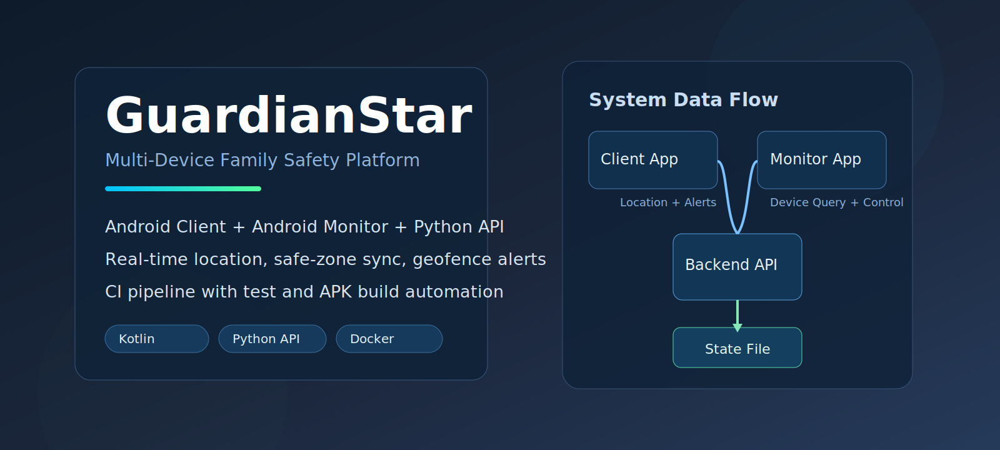
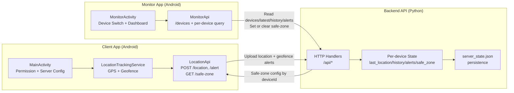
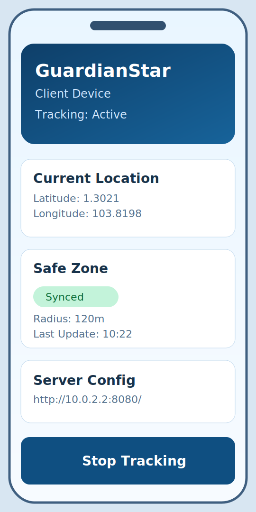
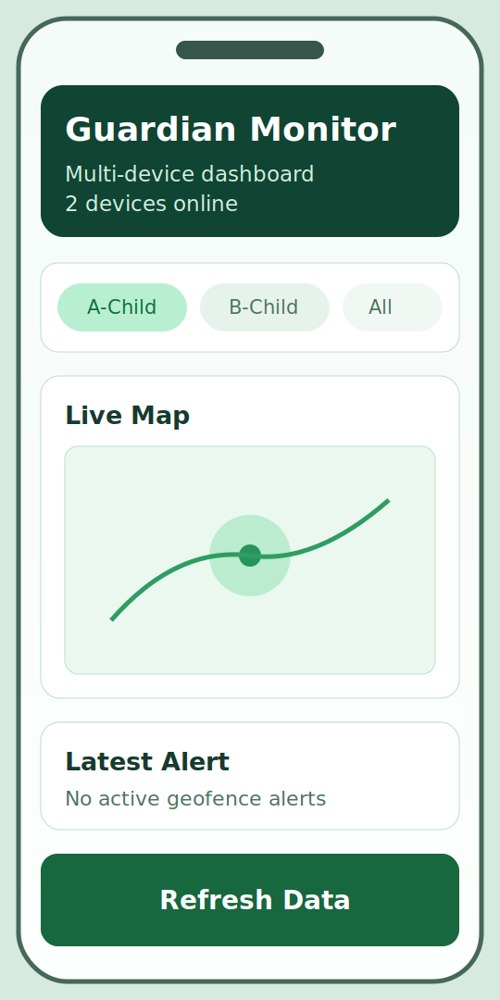
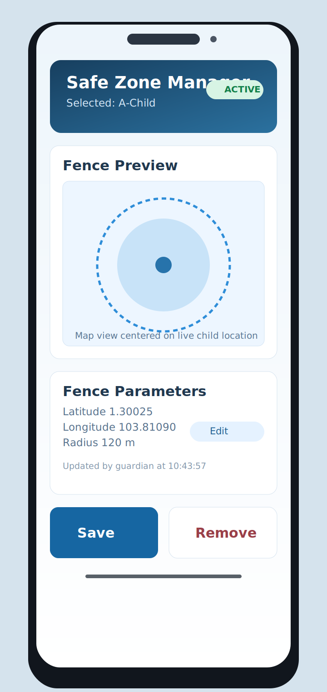

<p align="center">
  
</p>

<h1 align="center">GuardianStar</h1>
<p align="center">
  Multi-device family safety platform with Android apps and a lightweight Python backend.
</p>

<p align="center">
  <a href="https://github.com/MackJack023/GuardianStar/actions/workflows/android-ci.yml"></a>
  <a href="https://github.com/MackJack023/GuardianStar/releases"></a>
  <a href="./LICENSE"></a>
  
  
  
  
</p>

<p align="center">
  <a href="#overview">Overview</a> |
  <a href="#system-architecture-one-diagram">Architecture</a> |
  <a href="#app-screenshots">Screenshots</a> |
  <a href="#quick-start">Quick Start</a> |
  <a href="#api-surface">API</a> |
  <a href="#roadmap">Roadmap</a> |
  <a href="#contributing">Contributing</a>
</p>

## Overview

GuardianStar is an end-to-end safety monitoring prototype with:

- `Client` Android app (child device)
- `Monitor` Android app (guardian device)
- Python backend API with per-device state

The project supports real-time location reporting, safe-zone synchronization, geofence entry/exit alerts, multi-device dashboard monitoring, and automated CI build pipelines.

## Why This Project

- Demonstrates a complete two-app + backend architecture
- Uses a clean `deviceId` based data isolation model
- Includes Dockerized backend startup for quick local deployment
- Ships with GitHub Actions for tests, Android builds, and release artifacts

## Core Features

- Multi-device tracking and monitor switching
- Real-time location upload and latest location view
- Safe-zone create/read/delete by `deviceId`
- Android geofence integration on Client
- Alert collection and visualization in Monitor
- Backend persistence with `server_state.json`

## System Architecture (One Diagram)



Detailed architecture page: [docs/architecture.md](./docs/architecture.md)

## App Screenshots

> Current images are polished placeholders for repository presentation. Replace with real device screenshots anytime without changing layout.

| Client Home | Client Settings |
|---|---|
|  |  |

| Monitor Overview | Monitor Safe Zone |
|---|---|
|  |  |

## Tech Stack

| Layer | Stack |
|---|---|
| Client App | Kotlin, Jetpack Compose, Retrofit, Google Location/Geofence |
| Monitor App | Kotlin, Jetpack Compose, Retrofit |
| Backend | Python 3, `http.server`, JSON state persistence |
| DevOps | GitHub Actions, Docker Compose |

## Repository Layout

```text
.
├─ Client/                # Child device Android app + unified Gradle entry
│  ├─ src/main/...
│  └─ server/             # Python backend + tests
├─ Monitor/               # Guardian Android app module
├─ docs/
│  ├─ architecture.md
│  ├─ releases/v1.0.0.md
│  └─ assets/
└─ .github/workflows/
   └─ android-ci.yml
```

## Quick Start

### 1. Start Backend (Local)

```bash
cd Client/server
python server.py
```

Backend default address: `http://localhost:8080`

### 2. Or Start Backend with Docker

```bash
docker compose up --build
```

### 3. Build Both Android Apps

```bash
cd Client
./gradlew --no-daemon clean assembleDebug :monitor:assembleDebug
```

APK outputs:

- `Client/build/outputs/apk/debug/GuardianStar-debug.apk`
- `Monitor/build/outputs/apk/debug/monitor-debug.apk`

### 4. Install APKs

```bash
adb install -r Client/build/outputs/apk/debug/GuardianStar-debug.apk
adb install -r Monitor/build/outputs/apk/debug/monitor-debug.apk
```

## Configuration

### Client App

Default server URL: `http://10.0.2.2:8080/`

For physical devices, update in app:

- `Profile -> Server Settings`

### Monitor App

Copy `Monitor/local.properties.example` to `Monitor/local.properties` and set values:

```properties
monitor.baseUrl=http://10.0.2.2:8080/
amap.webApiKey=your-amap-web-api-key
```

## API Surface

### Read Endpoints

- `GET /api/health`
- `GET /api/devices`
- `GET /api/latest?deviceId=...`
- `GET /api/history?deviceId=...`
- `GET /api/alerts?deviceId=...`
- `GET /api/safe-zone?deviceId=...`

### Write Endpoints

- `POST /api/location`
- `POST /api/alert`
- `POST /api/safe-zone`
- `DELETE /api/safe-zone?deviceId=...`

## Quality Gates

- Backend unit tests: `python -m unittest discover -s .\Client\server -p "test_*.py"`
- Android build check: `cd Client && .\gradlew.bat --no-daemon clean assembleDebug :monitor:assembleDebug`
- CI workflow: [android-ci.yml](./.github/workflows/android-ci.yml)
- Tag release notes: [docs/releases/v1.0.0.md](./docs/releases/v1.0.0.md)

## Roadmap

- Introduce user authentication and guardian-child ownership model
- Migrate state from JSON file to SQLite/PostgreSQL
- Add push notification delivery for geofence alerts
- Add production-grade API auth middleware and audit logging
- Improve map interaction and multi-device UX in Monitor app

## Maturity Notes

GuardianStar is release-tagged and CI-validated, but still positioned as a prototype platform rather than a production service. The next milestone should focus on auth, data durability, and security hardening.

## Contributing

Please read [CONTRIBUTING.md](./CONTRIBUTING.md) before opening pull requests.

## Security

For vulnerability reporting, see [SECURITY.md](./SECURITY.md).

## Code of Conduct

Community expectations are defined in [CODE_OF_CONDUCT.md](./CODE_OF_CONDUCT.md).

## License

This project is licensed under the terms in [LICENSE](./LICENSE).

