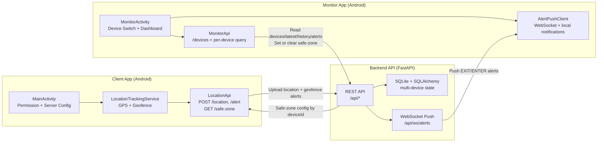

<p align="center">
  
</p>

<h1 align="center">GuardianStar</h1>
<p align="center">
  Multi-device family safety platform with Android apps and a production-ready Python backend.
</p>

<p align="center">
  <a href="https://github.com/MackJack023/GuardianStar/actions/workflows/android-ci.yml"></a>
  <a href="https://github.com/MackJack023/GuardianStar/releases"></a>
  <a href="https://github.com/MackJack023/GuardianStar/releases"></a>
  <a href="./LICENSE"></a>
  
  
  
  
  
</p>

<p align="center">
  <a href="#overview">Overview</a> |
  <a href="#system-architecture-one-diagram">Architecture</a> |
  <a href="#app-screenshots">Screenshots</a> |
  <a href="#quick-start">Quick Start</a> |
  <a href="#api-surface">API</a> |
  <a href="#documentation">Docs</a> |
  <a href="#contributing">Contributing</a>
</p>

## Overview

GuardianStar is an end-to-end safety monitoring project with:

- `Client` Android app (child device)
- `Monitor` Android app (guardian device)
- FastAPI backend with SQLite persistence and WebSocket alert push

The project supports location reporting, safe-zone synchronization, geofence entry/exit alerts, monitor push notifications, and CI-validated Android builds.

## Why This Project

- Demonstrates a complete two-app + backend architecture
- Uses a `deviceId`-scoped multi-device data model
- Migrates legacy JSON state to SQLite automatically
- Includes Dockerized backend startup and GitHub Actions pipelines

## Core Features

- Multi-device tracking and monitor switching
- Real-time location upload and latest location view
- Safe-zone create/read/delete by `deviceId`
- Android geofence integration in Client app
- Alert collection and local push notification in Monitor app
- Backend persistence with SQLite (`guardianstar.db`)
- Real-time alert stream over `WS /api/ws/alerts`

## System Architecture (One Diagram)



Detailed architecture page: [docs/architecture.md](./docs/architecture.md)

## App Screenshots

| Client Home | Client Settings |
|---|---|
|  |  |

| Monitor Overview | Monitor Safe Zone |
|---|---|
|  |  |

## Tech Stack

| Layer | Stack |
|---|---|
| Client App | Kotlin, Jetpack Compose, Retrofit, Google Location/Geofence |
| Monitor App | Kotlin, Jetpack Compose, Retrofit, OkHttp WebSocket, Android Notifications |
| Backend | Python, FastAPI, SQLAlchemy, SQLite, WebSocket |
| DevOps | GitHub Actions, Docker Compose |

## Repository Layout

```text
.
|- Client/                  # Child app + Gradle entry + backend folder
|  |- src/main/...
|  |- server/               # FastAPI backend + DB migration + tests
|- Monitor/                 # Guardian app module
|- docs/
|  |- architecture.md
|  |- DEPLOYMENT.md
|  |- REAL_DEVICE_VALIDATION.md
|- .github/workflows/
   |- android-ci.yml
```

## Quick Start

### 1. Start Backend (Local)

```bash
cd Client/server
pip install -r requirements.txt
python server.py
```

Backend default address: `http://localhost:8080`

### 2. Or Start Backend with Docker

```bash
docker compose up --build
```

### 3. Build Both Android Apps (Java 17 Target)

```bash
cd Client
./gradlew --no-daemon clean assembleDebug :monitor:assembleDebug
```

APK outputs:

- `Client/build/outputs/apk/debug/GuardianStar-debug.apk`
- `Monitor/build/outputs/apk/debug/monitor-debug.apk`

### 4. Install APKs

```bash
adb install -r Client/build/outputs/apk/debug/GuardianStar-debug.apk
adb install -r Monitor/build/outputs/apk/debug/monitor-debug.apk
```

## Configuration

### Client App

Default server URL: `http://10.0.2.2:8080/`

For physical devices, update in app:

- `Profile -> Server Settings`

### Monitor App

Copy `Monitor/local.properties.example` to `Monitor/local.properties` and set values:

```properties
monitor.baseUrl=http://10.0.2.2:8080/
amap.webApiKey=your-amap-web-api-key
```

### Backend Environment

```bash
PORT=8080
GUARDIANSTAR_DATABASE_URL=sqlite:///./guardianstar.db
GUARDIANSTAR_LEGACY_STATE_FILE=./server_state.json
GUARDIANSTAR_ALERT_WEBHOOK_URL=https://your-webhook-endpoint.example
```

## API Surface

### Read Endpoints

- `GET /api/health`
- `GET /api/devices`
- `GET /api/latest?deviceId=...`
- `GET /api/history?deviceId=...`
- `GET /api/alerts?deviceId=...`
- `GET /api/safe-zone?deviceId=...`

### Write Endpoints

- `POST /api/location`
- `POST /api/alert`
- `POST /api/safe-zone`
- `DELETE /api/safe-zone?deviceId=...`
- `POST /api/push/register`
- `DELETE /api/push/register?token=...`

### Realtime Endpoint

- `WS /api/ws/alerts?deviceId=...`

## Documentation

- Architecture: [docs/architecture.md](./docs/architecture.md)
- Deployment guide: [docs/DEPLOYMENT.md](./docs/DEPLOYMENT.md)
- Device validation checklist: [docs/REAL_DEVICE_VALIDATION.md](./docs/REAL_DEVICE_VALIDATION.md)
- Release notes: [docs/releases/v1.0.1.md](./docs/releases/v1.0.1.md), [docs/releases/v1.0.0.md](./docs/releases/v1.0.0.md)
- Changelog: [CHANGELOG.md](./CHANGELOG.md)

## Quality Gates

- Backend unit tests: `python -m unittest discover -s .\Client\server -p "test_*.py"`
- Android build check: `cd Client && .\gradlew.bat --no-daemon clean assembleDebug :monitor:assembleDebug`
- CI workflow: [android-ci.yml](./.github/workflows/android-ci.yml)
- Dependency update bot: [dependabot.yml](./.github/dependabot.yml)

## Roadmap

- Introduce user authentication and guardian-child ownership model
- Add PostgreSQL deployment profile for multi-instance backend
- Add signed API auth tokens and ownership ACL
- Add delivery retry and dead-letter queue for push provider
- Improve map interaction and multi-device UX in Monitor app

## Contributing

Please read [CONTRIBUTING.md](./CONTRIBUTING.md) before opening pull requests.

## Security

For vulnerability reporting, see [SECURITY.md](./SECURITY.md).

## Code of Conduct

Community expectations are defined in [CODE_OF_CONDUCT.md](./CODE_OF_CONDUCT.md).

## License

This project is licensed under the terms in [LICENSE](./LICENSE).
