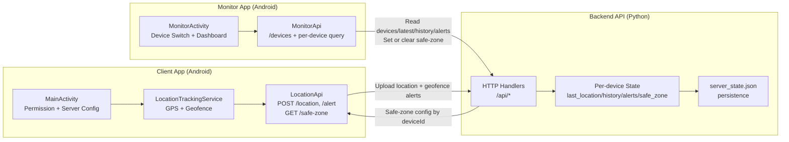

# GuardianStar Architecture

The following diagram explains the complete end-to-end system in one view.

```mermaid
flowchart LR
  subgraph C["Client App (Android)"]
    C1["MainActivity\nPermission + Server Config"]
    C2["LocationTrackingService\nGPS + Geofence"]
    C3["LocationApi\nPOST /location, /alert\nGET /safe-zone"]
    C1 --> C2 --> C3
  end

  subgraph B["Backend API (Python)"]
    B1["HTTP Handlers\n/api/*"]
    B2["Per-device State\nlast_location/history/alerts/safe_zone"]
    B3["server_state.json\npersistence"]
    B1 --> B2 --> B3
  end

  subgraph M["Monitor App (Android)"]
    M1["MonitorActivity\nDevice Switch + Dashboard"]
    M2["MonitorApi\n/devices + per-device query"]
    M1 --> M2
  end

  C3 -- "Upload location + geofence alerts" --> B1
  M2 -- "Read devices/latest/history/alerts\nSet or clear safe-zone" --> B1
  B1 -- "Safe-zone config by deviceId" --> C3
```

