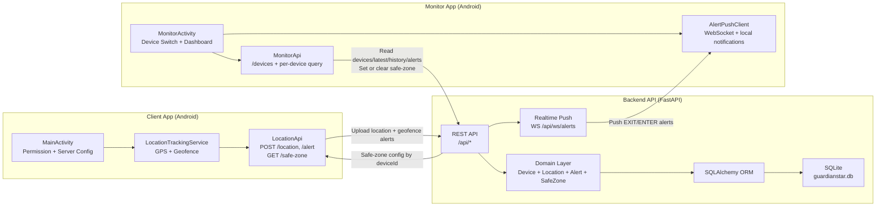

# GuardianStar Architecture

The following diagram explains the complete end-to-end system in one view.

## Runtime Components

- API framework: FastAPI + Uvicorn
- Persistence: SQLAlchemy ORM + SQLite
- Alert push channel: backend WebSocket + Monitor local notification
- Legacy migration: `server_state.json` auto-import on first startup

## Data Model

- `devices`: unique `deviceId` and lifecycle timestamps
- `locations`: geolocation history per device
- `alerts`: geofence and safety events
- `safe_zones`: active safe-zone settings per device
- `push_tokens`: reserved registry for external push provider integration
